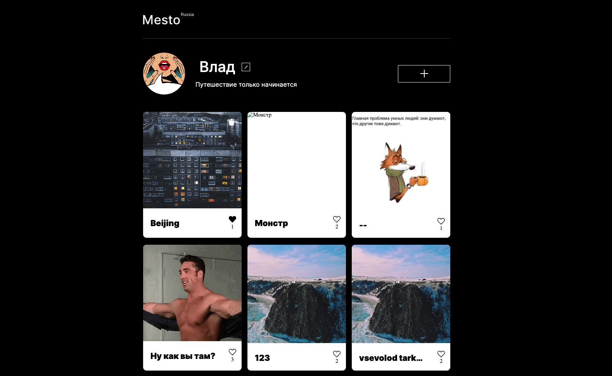
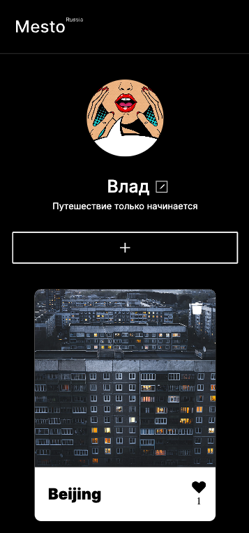

# mesto

## Описание проекта

В этот сервис можно добавлять фотографии интересных мест, удалять их и ставить лайки.

| Desktop | Mobile |
|-------------|-------------|
|||

## Основной функционал

* создание новой карточки с фото,
* постановка и снятие лайка с любых карточек,
* возможность удаления карточки, но только текущего пользователя,
* редактирование данных текущего пользователя,
* возможность просмотра любого фото в полноэкранном режиме.
* Код объектно-ориентирован
* реализованы классы на ES6 синтаксисе,
* весь JavaScript код разбит на модули,
* каждый класс выполняет строго одну задачу (всё, что относится к решению этой задачи, находится внутри данного класса),
* для описания взаимодействия между классами используется слабое связывание (внутри классов напрямую не создаются экземпляры других классов),
* класс Popup базовый, имеет наследников, создающихся для каждого модального окна,
* экземпляр класса Card создаётся для каждой карточки,
* экземпляр класса FormValidator создаётся для каждой проверяемой формы,
* создан класс Api, внутри которого описаны все запросы к серверу.

## Технологии
* HTML5,
* CSS3,
* JavaScript (ES6),
* Webpack,
* сайт адаптирован c media queries,
* flexbox,
* grid,
* модальные окна (реализовано закрытие по нажатию на Esc и клику по оверлею),
* БЭМ (наименование классов и организация файловой структуры Nested),
* изображения оптимизированы,
* сайт сверстан по макету из Figma.

  ## Для запуска проекта
* Клонировать репозиторий на свой компьютер через команду git clone https://github.com/VladimirAlbrekht/mesto.git
* Установить сборку npm i
* Запуск проекта npm run dev
* Итоговая сборка npm run build
